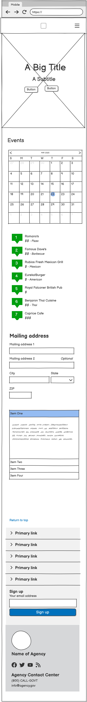

# Group-Project
group funtimes 

Tech-meet-up Cornwall:

evening-location: 

discussion and meetup informal

# Tech-Meet-Up Cornwall - User Stories

## 1️⃣ As a tech enthusiast…  
"I want to browse upcoming events easily, so I can plan my attendance and see which meet-ups interest me."  

### **Features needed:**  
- Event calendar  
- Filters for topics (AI, web dev, cybersecurity)  
- Easy registration system  

---

## 2️⃣ As a first-time attendee…  
"I want to understand the format and expectations of the meet-up, so I feel comfortable joining."  

### **Features needed:**  
- FAQ section  
- Testimonials from past attendees _(optional consideration)_  

---

## 3️⃣ As an organizer…  
"I want an intuitive way to manage event logistics and registrations, so I can ensure everything runs smoothly."  

### **Features needed:**  
- Admin dashboard  
- RSVP tracking  
- Automated updates
  
---

## Generated layout design
We used chat GPT to generate [the layout design](./GPT_layout_ideas.md)

---
# Wireframes

### Mobile

